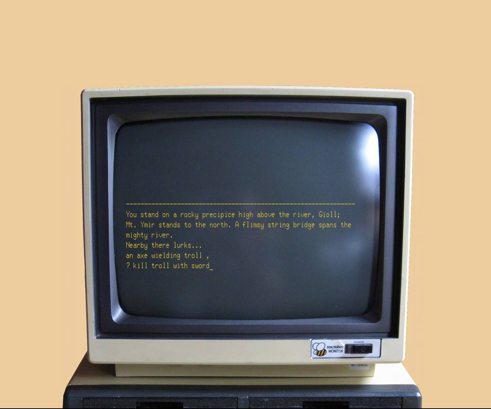
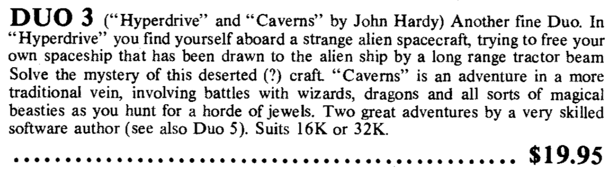

This is my old program *Caverns*, released in 1983, the same year as the TEC-1. It was the first substantial program that I wrote and I'm glad to see it again after all these years. I lost a copy of the source code years ago but luckily the game got saved in the collections of hobbyists and then finally preserved by the MSPP (more below). It's kind of a miracle that it wasn't lost for good in the intervening 35 years.

*Caverns* began life as a text adventure game for the Sinclair ZX81 (16K extension) back in 1982. Not long after that my friend Ken Stone and I hand-ported it across to his Commodore VIC-20 and we worked on it together there. Then finally I transferred it yet again, this time to the Microbee, still my favourite machine from that period. Each port led to various modifications and extensions. The Microbee version integrated many of the things I had learned.

It's a supreme piece of spaghetti code written in BASIC!

You can find advertisements in Talking Electronics magazine where we sold the program on cassette. The ad for Ken's Vic-20 version can be seen in Issue 8 and  my Microbee version can be seen as in a full-page ad in Issue 10. Yes, in those days, software was still so rare, you could actually sell it! I've put a few samples in the adverts folder of this repo.


Later in 1983, the program came to be distributed by Lindsay R Ford's Dreamcards company as a so-called "DUO" pack, that is, bundled with another program. That other program was *Hyperdrive II*, a scifi influenced text adventure based on a story by Ken Stone and an earlier version of the game that he had written for the Vic-20. The version for the Microbee was a reworking by me using mostly the same BASIC "engine" that ran in *Caverns*. *Hyperdrive II* draws on the experience gained in writing *Caverns* and is more ambitious and slightly more advanced. Unfortunately the Vic-20 versions of both games appear to have been lost to the ages. That's what makes the survival of the Microbee versions especially remarkable.



Right here I'd like to stop and say thanks to the [Microbee Software Preservation Project](https://microbee-mspp.org.au) and especially to Alan Laughton (aka ChickenMan) who was critical in compiling the disks of files that these games got preserved on. But I'd especially like to thank Alan for his help and generosity in helping me recover the original text of the programs and for pointing me in the right direction. I'm doing my bit for the preservation of my tiny piece of Microbee software but releasing the source code under the GNU Public License.

Also included in this repo is a node script that I wrote for reading Microbee MicroWorld Basic files (MWB) and converting their tokens back into something human readable.

Note: the top image is taken from the [NanoWasp emulator](http://nanowasp.org/). 


Here is the intoductory text for Caverns.

```
You are standing in an old deserted hut. There is a door to the north.
You can see a sign on the wall, should I read it master?
The sign reads as follows.
Deep in the icy mountains of northern Iotunheim there lived a small band of elves who called themselves 'The Great Sons of Svartalfheim.'
These elves worked day and night deep underground in the limestone caves, mining for precious minerals which they fashioned into jewellery.
So prized were their products that merchants and traders came from distant Asgar and Fenris to purchase them.
The elves became very prosperous and built a mighty empire deep underground which linked all the mines to a central city.
Then one day, the King of the Danes, who was a very greedy man, sent his troops into the mines to sack the golden city.
Every elf found was to be brought to the Royal Palace to work in the foundry.
This was done and all the inhabitants of Svartalfheim were forced to live within the city walls.
Suddenly, to the surprise of all around, the elves began to die as if of some strange illness.
Nothing could be done to save them and within a few weeks all of the elves were dead and their wonderful gifts lost forever.
The King was furious and executed several of his courtesans, but the damage had already been done.
Centuries passed and the story of Svartalfheim faded from memory until one day a goatherd called Peter ran into town with an incredible story.
'Way up in the hills,' he said, 'is the entrance to a cave guarded by a green serpent that breathes flames!' Peter told a story of how he managed to escape the fiery breath of the dragon and found a tiny room filled with more gold and silver than he could possibly carry.
The only jewel he could bring back to prove his story was a tinyruby ring which had obviously been crafted with great skill.
Peter led a group of his fellow villagers back up into the mountains beyond Mt. Ymir, but they were all killed in a rock fall before they could reach the entrance.
So Svartalfheim was once again lost and stories of its hidden treasures became myths.
It is four hundred years since the days of Peter the goatherd and you have come to Iotunheim to search for the treasure your- self. You followed the valley to a forest in the foothills of Ymir and set up a base in a small hut which at one time belongedto a hermit.
- - - RULES - - -
Your aim is to obtain the highest possible score by collecting as much treasure as possible.
You must find the legendary treasure room of Svartalfheim and bring the treasures back to this hut in order to maximize your score. To to achieve this endyou need to locate and manipulate several objects.
When directing commands to the computer you must specify exactlywhat you mean:
e.g. Kill dragon with sword 
(a shorthand way of saying this is `Use sword')
The command `use' causes the computer to execute the obvious function for the object:
e.g. use candle = burn <whatever> with candle
Several other commands exist which you must discover yourself, but here are some to start you off.
    North   Go north
    List    Give an inventory of objects carried
    Quit    Stop the game and give score
When journeying the lands of Iotunheim and Svartalfheim it may help to make a map.
Beware of paths that curve and double back on themselves particularly in the forest area.
You will also find a compass of immeasurable value.
Well the sun is rising, it is time you were on your way.
Good Luck!!
```

At the time I didn't know the difference between a courtier and a courtesan
but thinking back I think the King would have been more likely to kill is courtiers than his courtesans! :-)
