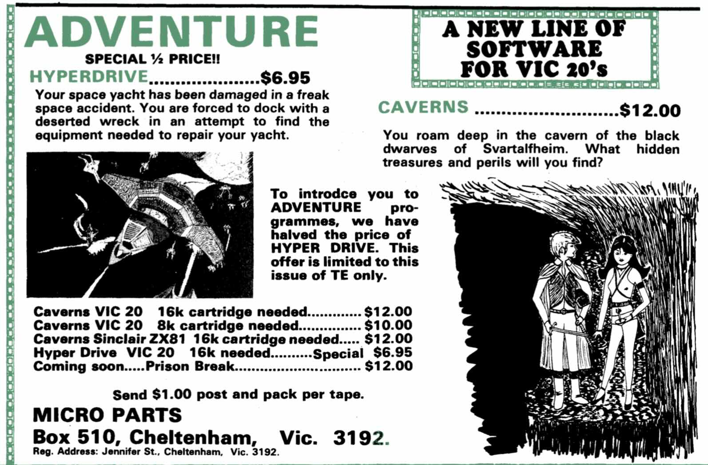
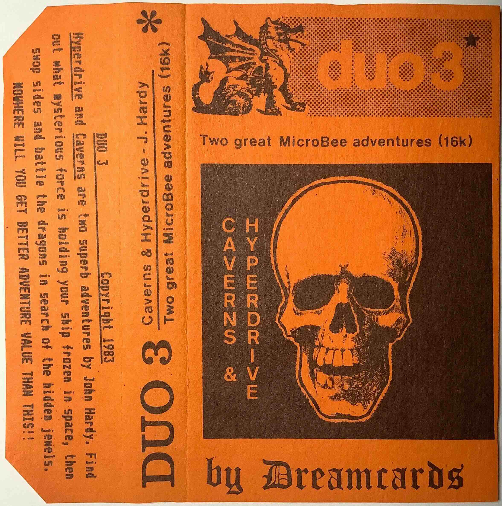
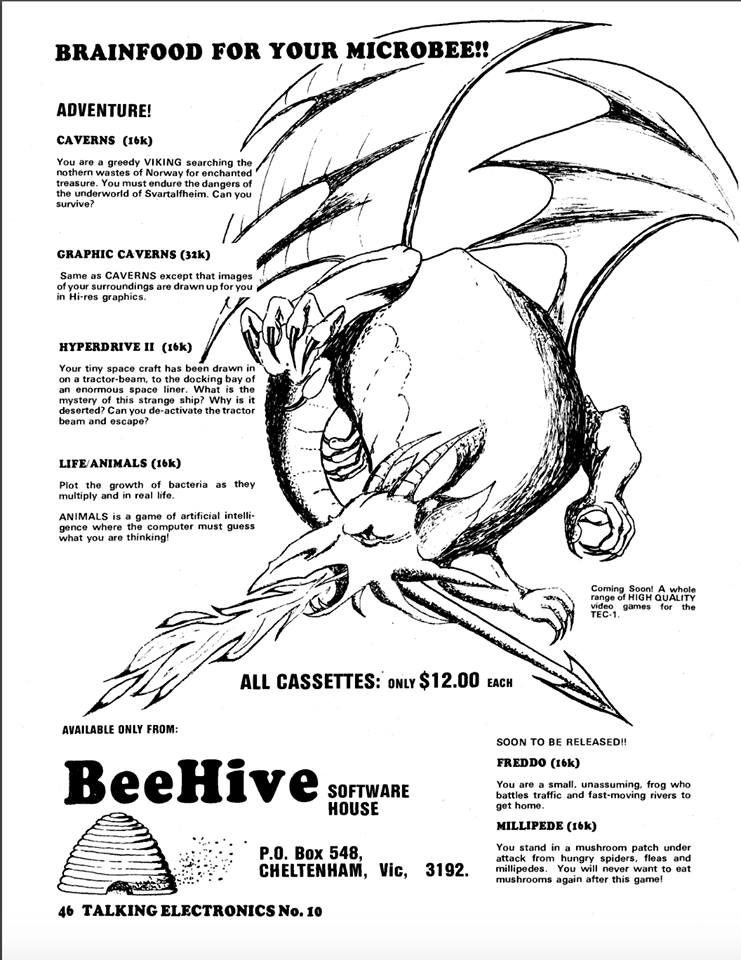

# Caverns: The 1982 Fantasy Adventure

## A Microbee Classic

Caverns is a fantasy text adventure written by John Hardy in 1982 and released
in 1983, the same year as the TEC-1. It began on the Sinclair ZX81 with a 16K
expansion, was co-ported with Ken Stone to the VIC-20, and then reworked for
the Microbee where it reached its most complete form. The Microbee listing
opens with a Dreamcards title card and credits the author for the 1983 release.

The program is classic 1980s BASIC: sprawling, direct, and surprisingly
ambitious for its era. It was the author's first substantial game, and it
remains one of the most detailed early Australian text adventures for the
Microbee.

## The Premise (From the Intro)

The intro frames Caverns as a Viking quest in the northern wastes of Norway.
Long ago the Great Sons of Svartalfheim built a subterranean empire of mines
and treasure. After the King of the Danes sacked their city, the elves perished
and the location of their hoard faded into myth. Centuries later, rumors of a
hidden cave and a green serpent reignite the legend. You arrive in Iotunheim,
standing in a small hut at the edge of the forest, with a single goal: find the
lost treasure of Svartalfheim.

## What the Game Feels Like

Caverns is a map-heavy adventure of forests, cliffs, rivers, and tunnels that
leads into the underworld. The game trades on hazards and folklore: trolls and
wizards, a fire-breathing dragon, a giant bat colony, and a temple devoted to
Loki. The geography is specific and harsh, with references to Mt. Ymir, the
river Gioll, and deep caverns carved under ancient basalt. Progress depends on
careful exploration, inventory management, and bringing treasure back to the
hut to raise your score.

## The Recovery Story

The source listing was lost for decades and survived only in hobbyist
collections. It was preserved through the Microbee Software Preservation
Project, with Alan Laughton (aka ChickenMan) providing guidance and access to
the original files. The recovered listing is released here under the GNU Public
License, reflecting the 2019 release note embedded in the BASIC program.

## Origins and Lineage

Caverns is the root of the later science-fiction branch of this lineage. The
VIC-20 spin on the idea is preserved in `jhlagado/hyperdrive`, and the Microbee
sequel-in-spirit is preserved in `jhlagado/hyperdrive2`. In 1983 Dreamcards
paired Caverns with Hyperdrive II as a "DUO" pack. That pairing links the
history of the two games without merging their identities. Early VIC-20
versions appear to have been lost, which makes the surviving Microbee listing
especially valuable.

## Contemporary Catalogue and Tape Copy

The period advertising situates Caverns in the early-1980s Microbee scene.
Talking Electronics Issue 10 promoted Caverns (16K) under the "Brainfood for
your Microbee" banner, describing a greedy Viking searching the northern
wastes for enchanted treasure in the underworld of Svartalfheim. The same ad
listed "Graphic Caverns" (32K), a hi-res variant that drew images of the
surroundings, and priced the cassette at $12.00 through BeeHive Software House.

A Talking Electronics Issue 8 advertisement offered Caverns for the VIC-20 and
ZX81, inviting players to roam the caverns of the black dwarves of
Svartalfheim in search of hidden treasures and perils. A Dreamcards catalogue
entry described DUO 3 ("Hyperdrive" and "Caverns" by John Hardy), suited to 16K
or 32K Microbees at $19.95. The DUO 3 cassette insert echoed the pairing with
"Two great Microbee adventures (16k)" and sales copy that paired a trapped
starship story with Caverns' hunt for hidden jewels.

The ads also clarify the business labels of the period: Micro Parts was Ken
Stone's business name, while BeeHive Software House was John Hardy's.

## What You Will Find Here

Primary artifacts:

- `src/caverns.basic`: restored BASIC source listing
- `src/caverns.mwb`: tokenized Microbee BASIC version
- `src/caverns-intro.basic`: title and story intro loader
- `src/caverns-intro.mwb`: tokenized intro program
- `src/protected/`: protected or obfuscated variants and tooling

Supporting material and notes:

- `docs/intro-text.md`: full intro story and rules text
- `docs/recovery-notes.md`: recovery narrative and preservation notes
- `docs/references.md`: source references and external links
- `assets/`: ads, catalogue scans, and emulator imagery

## Archival Images

Caption: Screenshot captured from the NanoWasp emulator.

Caption: Issue 8 Talking Electronics ad for the VIC-20 release.

Caption: DUO 3 insert listing Caverns and Hyperdrive II.

Caption: Dreamcards catalogue entry describing the DUO pack.

Caption: Issue 10 Talking Electronics ad for the Microbee release.
